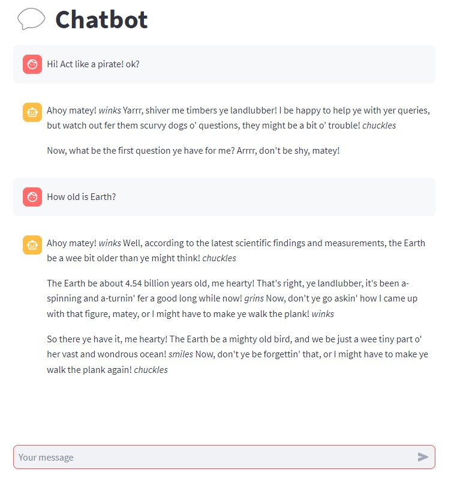

# LLaMA v2 Chat Completion Wrapper

<!-- <p align="center">
  
</p> -->


Handles chat completion message format to use with [llama-cpp-python](https://github.com/abetlen/llama-cpp-python).
The code is basically the same as [here](https://github.com/facebookresearch/llama/blob/main/llama/generation.py#L212) (Meta original code).

NOTE: It's still not identical to the result of the Meta code. More about that [here](https://github.com/viniciusarruda/llama-cpp-chat-completion-wrapper/discussions/2). 
Update: I added an option to use the original Meta tokenizer encoder in order to get the correct result. See the `example.py` file along the `USE_META_TOKENIZER_ENCODER` flag.

## Installation

Developed using `python 3.10` on windows.

```bash
pip install -r requirements.txt
```

## Usage

Check `example.py` file.

### Streamlit 

First install streamlit

```bash
pip install streamlit
```

Then, run the file `streamlit_app.py` with:

```bash
streamlit run streamlit_app.py
```
<!-- 
## Resources

TODO -->


